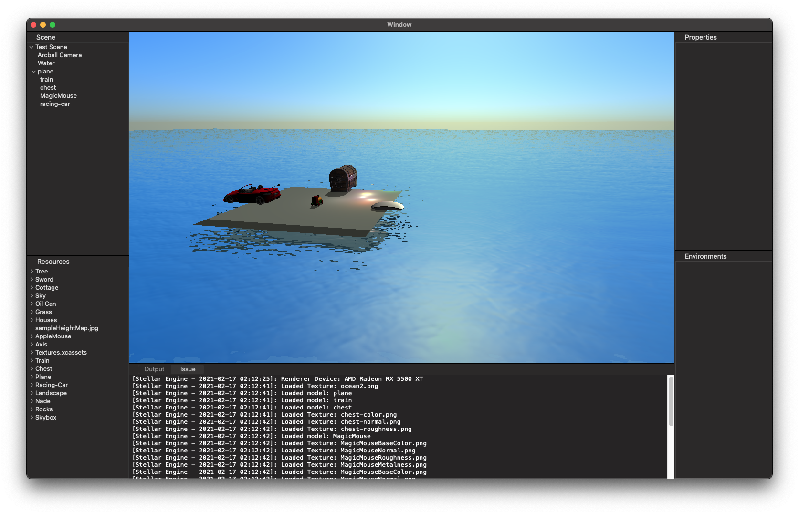
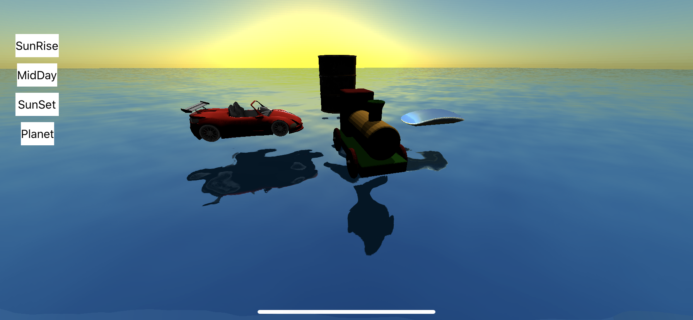
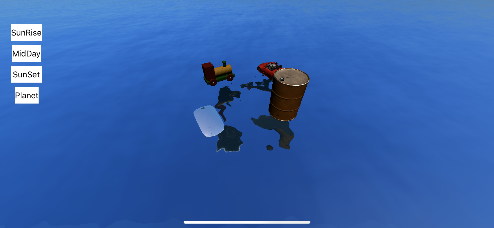
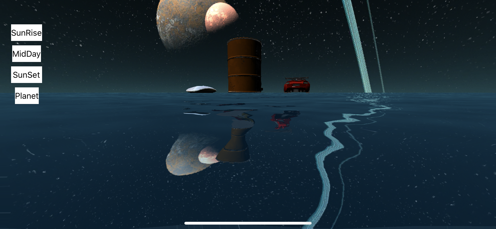

  

<h1 align="center">
    Stellar Engine
</h1>
<h4 align="center">
    A lightweight rendering engine written in Swift
</h4>

## Featuring:
- Physically based rendering
- Image based lighting
- Dynamic reflection
- Procedural skybox

## Planning to implement:
- Collision detection
- SSAO
- Global illumination
- Ray tracing (non real time)

## Current State: 
Simple GUI for macOS.

## Demo:

